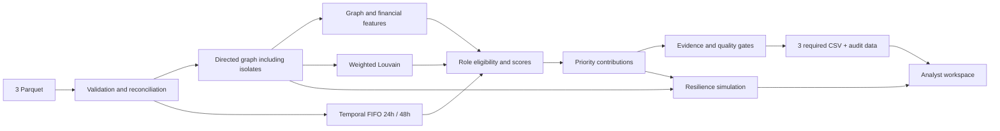

# Qadam — Junior Syndicate

Локальное рабочее место AML-аналитика для кейса Freedom / HackAlem AI. Из трёх parquet строит объяснимую модель сети: роли всех клиентов, сообщества и приоритет проверки. Каждый вывод можно разобрать до исходных метрик и вкладов факторов. Выводы — гипотезы для проверки.

## Быстрый запуск

Рекомендуемая проверенная среда: **Python 3.12**, CPU, без GPU, облака и API-ключей.

В корне проекта должны лежать `data/nodes.parquet`, `data/edges.parquet`, `data/transactions.parquet` из архива организаторов. Приватные parquet и локальные результаты не отправляются в Git автоматически.

Windows PowerShell, без необходимости менять execution policy:

```powershell
py -3.12 -m venv .venv
.\.venv\Scripts\python.exe -m pip install -r requirements-lock.txt
.\.venv\Scripts\python.exe run.py
.\.venv\Scripts\python.exe -m streamlit run app/app.py
```

На этом компьютере рабочая `.venv` уже создана; первые две команды повторять не нужно. Если системный `py` указывает на нерабочий WindowsApps launcher, используйте установленный Python 3.12 по полному пути.

Linux/macOS:

```bash
python3.12 -m venv .venv
.venv/bin/python -m pip install -r requirements-lock.txt
.venv/bin/python run.py
.venv/bin/python -m streamlit run app/app.py
```

Откройте **http://127.0.0.1:8501**. Приложение слушает только loopback. После установки зависимостей pipeline и основной интерфейс работают без интернета; ИИ-пояснение требует OpenAI API.

Если Supabase настроен, интерфейс использует Supabase Auth с подтверждением email и списком разрешённых пользователей. Настройка описана в [docs/AUTH.md](docs/AUTH.md). Без Supabase сначала создайте локальный аккаунт и сохраните резервный код. Регистрация, вход и восстановление работают без почтового сервиса. Дополнительно можно настроить Google OIDC; этот способ входа требует интернета и собственных OAuth-ключей. Настройка и ограничения: [docs/AUTH.md](docs/AUTH.md). Визуальный сценарий и управление графом: [docs/DEMO.md](docs/DEMO.md).

`requirements-lock.txt` фиксирует проверенные версии, включая SciPy для PageRank. `requirements.txt` задаёт минимальные зависимости для самостоятельного обновления; результаты между версиями NetworkX могут отличаться.

Один запуск от входов до результатов:

```bash
python run.py
python -m src.pipeline --data data --out output --config config/scoring.yaml
```

Это два эквивалентных варианта. Без входных файлов команда возвращает понятную ошибку и ненулевой exit code. По умолчанию пути привязаны к корню проекта, а не к текущему каталогу терминала.

## Проверено на реальных данных

Размещение на сервере, Docker и постоянное хранение аккаунтов: [docs/DEPLOY.md](docs/DEPLOY.md).

Предоставленные организаторами данные: 2 248 узлов, 3 119 рёбер, 4 840 транзакций, 81 seed, оборот **365 890 012,01 KZT**. Полный pipeline с дополнительным стресс-тестом занимал **11–32 секунды** на текущем Windows-компьютере (в том числе с параллельно работающим интерфейсом), значительно меньше лимита 300 секунд. Последнее точное время находится в `output/run_summary.json`.

| Роль | Узлов |
|---|---:|
| consolidator | 65 |
| transit | 117 |
| distributor | 144 |
| terminal | 296 |
| coordinator | 26 |
| peripheral | 1 600 |

Обнаружены **67 кластеров**, из них **9 содержат несколько seed**. Число кластеров не подгоняется под ожидаемые 8 сообществ из brief: используются логарифмические веса, учитываются маленькие компоненты и изоляты.

Все **444** граничных узла без исходящих сохранены; **0** из них названы terminal. Все **19** изолированных seed также сохранены. Есть **16** компонент со связями и **35**, если включить 19 изолятов. В brief эти два способа подсчёта смешаны; крупнейшая компонента содержит 1 877 узлов, вторая — 270.

Подробный автоматически обновляемый отчёт: `output/analysis_report.md` — top-20, объяснения top-5, примеры всех ролей и ограничения. Это результат правил, а не ground truth.

## Архитектура и владение кодом



| Файл | Ответственность |
|---|---|
| `src/load_data.py` | Типы, обязательные поля, сверка edges с transactions |
| `src/graph_builder.py` | Направленный граф, устойчивые ID сообществ |
| `src/features.py` | Финансовые, графовые, временные признаки |
| `src/scoring.py` | Роли, eligibility, confidence, приоритет и тексты |
| `src/pipeline.py` | Единый запуск, экспорты, отчёты, explain_node |
| `src/workspace.py` | Поиск/фильтры, срезы графа, контрагенты и карта |
| `src/resilience.py` | Модель удаления top-N и случайный baseline |
| `app/app.py` | Тонкий Streamlit-интерфейс |
| `config/scoring.yaml` | Веса, пороги, seed, параметры кластеризации |
| `starter/` | Неизменённый starter организаторов |

Базовые степени, суммы и количества операций сверяются тестом с `starter/basic_features`. От него решение расширено сохранением изолятов, валидацией сумм/количеств, временными признаками и объяснимым скорингом.

Командная граница: аналитические вычисления принадлежат `src/`; интерфейс использует те же exports и `explain_node`. Алишер может дорабатывать дизайн, не копируя формулы в UI. Алмас может исследовать `eda_report.json` и менять пороги через согласованный конфиг.

## Входы, валидация и EDA

| Файл | Обязательные поля |
|---|---|
| nodes.parquet | gid (int64), depth (0–4), is_seed (bool) |
| edges.parquet | src, dst (int64), sum_kzt, n_tx, depth |
| transactions.parquet | src, dst (int64), date, sum_kzt |

Некорректные ID, null, infinity, отрицательные/нулевые суммы, нулевые количества, неизвестные endpoints и неразбираемые даты приводят к ошибке. `false` не превращается в `True`. Пары, суммы (допуск 0,01 KZT) и количества транзакций сверяются с edges. Дублирующиеся рёбра агрегируются с предупреждением; исходные parquet не изменяются.

В реальных данных есть **97 одинаковых строк транзакций**. Без transaction_id невозможно доказать, что это ошибки: они сохраняются, поскольку согласуются с агрегатами организаторов.

`eda_report.json` содержит схемы, типы, null, распределение depth/seed, размеры компонент и квантили признаков. На реальных данных:

| Признак | Медиана | P95 | Максимум |
|---|---:|---:|---:|
| Число плательщиков | 1 | 3 | 24 |
| Число получателей | 0 | 5 | 116 |
| Входящий поток, KZT | 50 000 | 613 779 | 4 500 000 |
| Исходящий поток, KZT | 0 | 747 120,90 | 23 001 375 |
| Сумма отдельного перевода, KZT | 30 000 | см. EDA | 3 000 000 |

Порог ≥3 контрагентов отделяет выраженную структуру от обычной пары. Масштаб насыщения 8 соответствует сильному fan-in и fan-out, но не фиксирует число назначенных ролей. Это экспертные начальные параметры, обоснованные EDA, без обучения на метках.

## Признаки

Суммы, средние, медианы и максимумы считаются **по отдельным транзакциям**. Степени и уникальные контрагенты — по направленным связям без self-loop. Самопереводы сохраняются в денежных итогах, но не создают искусственных контрагентов.

`observed_net = sum_in - sum_out` — разность в выборке, не баланс счёта. При нулевом входе `flow_through_ratio` не определён (NaN), а не равен нулю.

PageRank взвешен по сумме. Betweenness использует **направленные невзвешенные кратчайшие пути**: денежная сумма не трактуется как длина пути. До 1 000 узлов расчёт точный, выше — 256 источников, seed=42. Точность оценки centrality ограничена выборкой.

`seed_reach` — число seed, из которых узел достижим по направлению денег; это не просто число соседей-seed. Рассчитываются минимальная дистанция, participation coefficient по сообществам соседей, articulation flag, two-hop reach, входящие и исходящие сообщества.

Нормализация `P(x)`: нулю/неопределённому значению соответствует 0; положительные значения получают средний percentile rank среди положительных. Поэтому у изолятов нулевые признаки не становятся «средними». Percentile rank устойчив к выбросам; предварительный log1p не меняет порядок и здесь не нужен.

## Формальные критерии ролей

Обозначения: `V=P(sum_in+sum_out)`, `I=P(sum_in)`, `O=P(sum_out)`, `PR=P(PageRank)`, `B=P(betweenness)`.

`FI=P(in_degree)×min(in_degree/8,1)`; `FO=P(out_degree)×min(out_degree/8,1)`.
`R=clip(1−out/in,0,1)`; для seed его вклад умножается на 0,25.
`U=P(число входящих сообществ)`.
`bridge=0,7×participation + 0,3×articulation_flag`.
`participation=1−Σ(доля соседей в сообществе)²`.

| Роль | Условия допуска | Сырой score |
|---|---|---|
| consolidator | ≥3 плательщика, положительный вход | 0,40 FI + 0,25 I + 0,15 PR + 0,10 R + 0,10 U |
| distributor | ≥3 получателя, положительный выход | 0,45 FO + 0,25 O + 0,15 P(n_out_tx) + 0,15 out_degree/total_degree |
| transit | Вход и выход; для non-seed out/in ∈ [0,5; 1,5]; для seed FIFO48 ≥0,8 | 0,35 similarity + 0,30 FIFO48 + 0,15 V + 0,10 middle + 0,10 B |
| terminal | Не seed, depth<4, ≥2 входящих перевода, retention≥0,8 | (0,35 I + 0,40 R + 0,25 P(n_in_tx)) × (1−0,5 FI) |
| coordinator | ≥3 связей, betweenness>0 и его положительный percentile≥0,8; ≥2 соседних сообщества или articulation | 0,40 B + 0,25 bridge + 0,15 P(seed_reach) + 0,10 PR + 0,10 V |
| peripheral | Доступна всегда | 1−max(пяти специализированных scores) |

`middle=1` при наличии входа и выхода.
`similarity=clip(1−max(|out/in−1|−0,2;0)/0,8;0;1)`; для seed вклад умножен на 0,25.
Недопущенная роль имеет score=0. Побеждает argmax шести scores; равенства разрешаются фиксированным порядком ролей из кода. Скидка terminal при большом fan-in помогает разделить накопление от множества плательщиков и обычное наблюдаемое удержание.

Большая доля peripheral вызывает предупреждение, но не принудительное перераспределение ролей. У многих клиентов действительно наблюдаются только 1–2 связи.

**role_score — эвристическая обоснованность, не калиброванная вероятность.**
Пусть top — лучший score, margin — разница с вторым:

`role_score = (0,6×top + 0,4×min(margin/0,25;1)) × Q`.

Качество наблюдения `Q` начинается с 1 и умножается на 0,75 для depth=4, на 0,8 для seed, на 0,8 при <3 наблюдаемых операциях. Понижение уверенности не стирает реальные признаки fan-in/fan-out на границе.

## Приоритет и доказательность

`priority_score = Q × (0,25 structural + 0,20 financial + 0,20 seed_relevance + 0,20 role_importance + 0,10 anomaly + 0,05 temporal)`.

- structural = (P(betweenness) + P(PageRank) + participation)/3.
- financial = P(sum_in + sum_out).
- seed_relevance = 0,6 P(seed_reach) + 0,4/(1+minimum_distance); недостижимые узлы получают 0 по дистанции.
- role_importance = вес роли × role_score. Веса: coordinator 1; consolidator 0,9; distributor 0,85; transit 0,7; terminal 0,5; peripheral 0,1.
- anomaly = (P(in_degree)+P(out_degree))/2. Это вспомогательная структурная необычность, не ML-модель и не аномальный баланс.
- temporal = FIFO48.

Для узлов без внешних связей priority=0. Это отсутствие структурных доказательств в выборке, не утверждение об отсутствии риска. Веса составляют 1, компоненты ограничены [0,1]. Приоритет не перенормируется после расчёта, чтобы сумма вкладов оставалась проверяемой.

Каждый вклад сохраняется в `node_features.csv`. `top_nodes.why` содержит три максимальных слагаемых и реальные показатели. `nodes_roles.evidence` содержит описание роли с числами, не более 200 символов. Ограничения seed/depth сохраняются даже при сокращении текста.

```python
from src.pipeline import explain_node
card = explain_node(100000003115284100)
# metrics, role_factors, priority_factors, limitations, evidence, priority_why
```

GID в этом примере — реальный пример демонстрации, не правило классификации. Любой входной GID обрабатывается одинаково. В UI идентификаторы передаются строками, чтобы JavaScript и табличный вид не округляли int64.

## Кластеризация

Louvain работает на неориентированной проекции: сначала суммируются встречные направления, затем используется `log1p(сумма)`. Так крупная единичная связь не полностью подавляет структуру связей меньшего объёма. Направление сохраняется в основном графе, признаках и UI.

Random seed=42, resolution=1; ID кластеров упорядочены по убыванию размера, затем по минимальному GID. Изолированный узел получает отдельный кластер. Внутренний оборот считается по оригинальным направленным рёбрам ровно один раз, без удвоения от проекции.

## Временной анализ

FIFO раздельно для окон 24 и 48 часов сопоставляет входящие суммы с более поздними исходящими. Вход может быть частично сопоставлен с несколькими выходами, но одна исходящая сумма не расходуется дважды. Просроченные входы исключаются.

В данных есть только **даты**, а не время. Все события одного дня имеют одинаковый timestamp и не сопоставляются между собой. Интервалы 24/48 часов — приближение на основе календарных дат, не утверждение о точной задержке. Включение timezone UTC техническое, исходный часовой пояс неизвестен.

В общем случае это наблюдаемый паттерн, не трассировка тех же банкнот: внешние входы/выходы отсутствуют. 97 одинаковых строк не удаляются без идентификатора транзакции.

## Экспорты и сценарий аналитика

| Файл | Схема / назначение |
|---|---|
| nodes_roles.csv | gid, role, role_score, cluster_id, priority_score, evidence |
| clusters.csv | cluster_id, n_nodes, n_seed, sum_kzt_internal, top_gids, hypothesis |
| top_nodes.csv | rank, gid, role, priority_score, why; top-50 |
| node_features.csv | Все метрики, роли, eligibility и вклады |
| graph_edges.csv | Исходные агрегированные связи для карты |
| eda_report.json | Квантили, схемы и распределения |
| run_summary.json | Итоги, конфиг, SHA256 входов, предупреждения и время |
| analysis_report.md | Итоговый разбор результатов для команды |
| resilience.csv | Сценарное удаление 1/3/5/10/20 узлов |

Проверка перед экспортом контролирует точный набор GID, уникальность, схемы, диапазоны, длину evidence, размеры/seed кластеров, последовательность и сортировку top-list. Для маленьких тестовых графов выводятся все доступные узлы вместо выдумывания 20 клиентов.

В интерфейсе:

1. Поиск произвольного GID → карточка и ближайшие входящие/исходящие связи.
2. Карта: окрестность, выбранный кластер, крупнейшая компонента или весь граф. Цвет по роли/кластеру, размер по приоритету, стрелки по направлению денег.
3. Таблица проверки с фильтром роли и кластера; скачивание трёх обязательных CSV.
4. Сообщество с гипотезой, seed, внутренним оборотом и картой.
5. Разложение роли/приоритета, ограничения наблюдения и следующий запрос данных.

Не нужно рисовать тысячи текстовых подписей: подписи только у выбранного и трёх значимых узлов; остальные — по hover. Ширина рёбер сгруппирована по log-сумме для производительности.

## Стресс-тест сети

Удаление top-N по приоритету сравнивается с 30 случайными выборками с фиксированным seed. Это виртуальный расчёт на слабой связности; он не изменяет данные и не рекомендует блокировку счетов.

При N=20 крупнейшая компонента содержит **1 445** оставшихся узлов против в среднем **1 844,23** при случайном удалении: около **64,9% против 82,8%** оставшихся узлов. Удаление top-20 увеличивает число компонент на 276. Структурный эффект не доказывает преступную роль. Приоритет не оптимизировался под эту метрику.

## Проверки и воспроизводимость

```powershell
.\.venv\Scripts\python.exe -m pytest -q
.\.venv\Scripts\python.exe -m pip check
```

Проверяются роли на синтетических структурах, невалидные входы, граница depth=4, изоляты, seed bias, денежное FIFO без двойного расходования, порядок дат, точность int64, CSV-схемы, детерминизм, сумма вкладов, сверка со starter и Streamlit-сценарии. UI-тесты используют созданный output; для чистой среды сначала выполните pipeline. Тест реальных данных пропускается, если организаторских parquet нет.

При смене Python/NetworkX сравните распределения и top-list; lock-файл фиксирует проверенную среду, входные хеши сохраняются в отчёте. Автообновление Streamlit не всегда сбрасывает импортированные модули: после изменения Python-модулей остановите сервер и запустите заново.

## Ограничения и масштабирование

- Глубина 4 скрывает исходящие операции: все 444 потенциальных ложных стока рассматриваются с ограничением, не как доказанные terminal.
- Входящие извне не видны; особенно ненадёжен баланс seed. Соотношение выхода/входа >1 само по себе не считается подозрением.
- Внутрибанковские операции и порог 5 000 KZT оставляют слепые зоны; мелкие и межбанковские переводы не исследуются.
- Отсутствуют клиентские атрибуты, внешнее обогащение, ground truth. Формулы требуют проверки аналитиком; нельзя заявлять precision/recall или «точность 95%».
- Кластеризация и приближённая betweenness зависят от конфигурации. Boundary/seed поправки — экспертные, не обученные вероятности.
- Изоляты сохраняются. Низкий score не заменяет проверку по другим источникам, которых здесь нет.

При миллионе узлов NetworkX и интерактивный полный layout становятся узкими местами. Перенести агрегации в Polars/DuckDB, граф в igraph/graph-tool или sparse CSR, использовать Leiden и выборочную centrality; считать локальные признаки по партициям, не выполнять all-pairs/reach для каждого seed. UI отдавать подграфы/агрегированные сообщества, а не миллион узлов. Миллионная версия здесь не реализована и её производительность не заявляется.

План 5-минутной защиты — [docs/DEMO.md](docs/DEMO.md). ИИ-пояснение подключается отдельно, см. ниже. Cycles и black-box anomaly model не входят в текущую версию.

## Qadam: ИИ-пояснение в веб-интерфейсе

Кнопка «Объяснить узел» добавлена в карточку клиента и окно «Полное обоснование» существующего HTML/CSS/JS-интерфейса. Браузер передаёт серверу только событие `{id, action: "explain", gid}`. После проверки сессии сервер сам выбирает узел из рассчитанных результатов. Присланные браузером роль, score или текст не используются.

Сервер отправляет OpenAI компактную сводку: строковый GID, роль, scores, кластер, число отправителей/получателей, суммы, PageRank, центральность, вклады факторов и ограничения. Связи ограничены пятью крупнейшими входящими и пятью исходящими агрегированными связями; число пропущенных указано. Сырые транзакции и весь граф в API не передаются.

Ответ имеет поля `summary`, `reasons`, `limitations` по Structured Outputs. Он служит только пояснением: роли, баллы, CSV и очередь проверок не меняются. Текст модели показывается как проверяемая гипотеза и требует сверки с исходными метриками.

### Подключение

Скопируйте `.env.example` в локальный `.env` рядом с `run.py` и заполните его на своём компьютере:

```dotenv
OPENAI_API_KEY=ваш_ключ
OPENAI_MODEL=gpt-4o-mini
QADAM_ALLOW_EXTERNAL_AI=true
```

Включайте передачу для синтетических или разрешённых к передаче данных. `.env` исключён из Git, пример без ключа — `.env.example`. Сервер читает файл через python-dotenv; переменные окружения имеют приоритет. Ключ не попадает в HTML, JavaScript и аргументы компонента.

Из корня проекта:

```bash
.venv/bin/python -m pip install -r requirements.txt
.venv/bin/python run.py
.venv/bin/python -m streamlit run app/app.py
```

После входа выберите GID на графе или через поиск и нажмите «Объяснить узел». Без настройки API кнопка отключена. При ошибке остаются исходная карточка и полное обоснование; повтор можно запустить вручную. Запрос не повторяется при перерисовке страницы. Ответ другого GID не отображается в текущей карточке; новый расчёт и выход очищают пояснение.

Тайм-аут API — 25 секунд, автоматических повторов нет, максимум 1200 выходных токенов. Используется `store=false`; это не обещание отсутствия журналирования у провайдера. Формат API сверялся с [официальной документацией Structured Outputs](https://developers.openai.com/api/docs/guides/structured-outputs).

Docker Compose передаёт эти три настройки в контейнер через окружение; `.env` не включается в образ. По умолчанию внешнее ИИ-пояснение отключено. Настройка размещения: [docs/DEPLOY.md](docs/DEPLOY.md).
