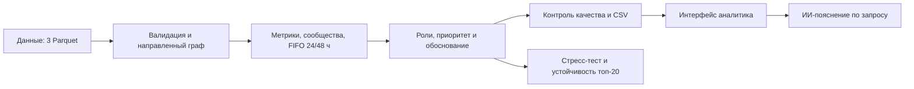

# Qadam — аналитика финансовых связей

**Пошаговый анализ транзакционной сети и приоритизация счетов для проверки.**

[Открыть онлайн-демо](https://junior-syndicate-faj8uwfznys43vozdelhwv.streamlit.app/) · [Основной репозиторий](https://github.com/BAITC-Hacks/hack-29b2f249-junior-syndicate) · [Зеркало для сайта](https://github.com/AlisherAt/junior-syndicate) · [Сценарий защиты](docs/DEMO.md)

**Junior Syndicate · HackAlem AI · кейс Freedom «Граф денег»**

AML-аналитик видит нижний уровень цепочки переводов и вручную выясняет, кто выше собирает, передаёт и распределяет деньги. Qadam превращает предоставленную транзакционную сеть в объяснимую очередь проверок: **кого посмотреть первым, какую роль предположить и на каких наблюдаемых фактах она основана**.

Из трёх Parquet-файлов приложение рассчитывает признаки, назначает роли всем клиентам, выделяет сообщества и формирует три обязательных CSV. Интерфейс связывает рейтинг с графом, карточкой узла и ограничениями данных. Дополнительное ИИ-пояснение помогает прочитать готовый результат, но не определяет роль или приоритет.

> Роль — гипотеза для проверки. Балл — не вероятность преступления. Qadam не устанавливает виновность и не принимает решения о блокировке счетов.

## Навигация

- [Что получает аналитик](#что-получает-аналитик)
- [Быстрый запуск](#быстрый-запуск)
- [Результаты на данных организаторов](#результаты-на-данных-организаторов)
- [Архитектура](#архитектура)
- [Входные данные](#входы-валидация-и-eda), [критерии ролей](#формальные-критерии-ролей) и [приоритет](#приоритет-и-доказательность)
- [Экспорты](#экспорты), [стресс-тест](#стресс-тест-сети) и [устойчивость топ-20](#устойчивость-рейтинга-к-настройкам)
- [Проверки](#проверки-и-воспроизводимость), [ограничения](#ограничения-и-масштабирование) и [ИИ-пояснение](#ии-пояснение)
- [Команда и документация](#команда-и-документация)

## Что получает аналитик

| Задача | Возможность Qadam |
|---|---|
| С чего начать проверку? | Ранжированный список: по умолчанию top-50, с числовым обоснованием приоритета |
| Что происходит с конкретным клиентом? | Поиск полного `gid`, входящие и исходящие связи, суммы, контрагенты и карточка роли |
| Почему назначены роль и балл? | «Полное обоснование»: исходные метрики, вклады факторов и ограничения наблюдения |
| Как связаны участники? | Направленная карта, цвет по роли или кластеру, окрестность узла, сообщество и полный граф |
| Какие группы стоит изучить? | Размеры кластеров, количество seed, внутренний оборот и проверяемая гипотеза |
| Можно ли выгрузить результат? | `nodes_roles.csv`, `clusters.csv`, `top_nodes.csv` и аналитический отчёт |
| Насколько результат зависит от настроек? | Отдельная CLI-проверка топ-20 при изменении весов и кластеризации |
| Как быстро прочитать сложную карточку? | Опциональная кнопка «Объяснить узел», работающая по рассчитанным данным |

Начальный обзор показывает 120 наиболее приоритетных узлов для читаемости; это не весь граф. В разделе «Анализ сети» доступны все 2 248 узлов. Колесо над картой меняет масштаб; для прокрутки страницы используйте область вне карты.

Онлайн-демо и его зеркало развёртывает Алишер. Основной командный репозиторий указан отдельно: автоматическая синхронизация зеркала не предполагается, версии могут различаться. Настройки входа и ИИ зависят от конкретного развёртывания; для воспроизводимой проверки используйте локальный запуск ниже.

## Быстрый запуск

Проверенная среда: **Python 3.12**, CPU. Для основного анализа не нужны GPU, облачная база или API-ключ. Интернет требуется для первоначальной установки зависимостей; сам расчёт работает локально.

Откройте терминал в корне проекта — каталоге с `run.py` и `requirements-lock.txt`. Если используете зеркало с вложенной папкой `Qadam`, сначала перейдите в неё.

Поместите данные организаторов в `data/`:

```text
data/
├── nodes.parquet
├── edges.parquet
└── transactions.parquet
```

Исходные Parquet и каталог `output/` исключены из Git: при клонировании основного репозитория их нужно получить отдельно у команды или организаторов. Не публикуйте данные без разрешения.

### Windows PowerShell

```powershell
py -3.12 -m venv .venv
.\.venv\Scripts\python.exe -m pip install -r requirements-lock.txt
$env:MONEY_GRAPH_AUTH='local'
$env:QADAM_ALLOW_EXTERNAL_AI='false'
.\.venv\Scripts\python.exe run.py
.\.venv\Scripts\python.exe -m streamlit run app/app.py
```

Если команда `py` недоступна, используйте путь к установленному Python 3.12. Активация окружения и изменение execution policy для этих команд не требуются.

### Linux / macOS

```bash
python3.12 -m venv .venv
.venv/bin/python -m pip install -r requirements-lock.txt
export MONEY_GRAPH_AUTH=local
export QADAM_ALLOW_EXTERNAL_AI=false
.venv/bin/python run.py
.venv/bin/python -m streamlit run app/app.py
```

Откройте [http://127.0.0.1:8501](http://127.0.0.1:8501), создайте локальный аккаунт и сохраните резервный код. В этом режиме вход работает без почтового сервиса; локальный сервер слушает только loopback. Аккаунты хранятся отдельно от аналитических данных, в SQLite.

Команды выше явно выбирают автономный режим и выключают внешнее ИИ-пояснение. Supabase Auth с подтверждением email и списком разрешённых пользователей, а также опциональный Google OIDC настраиваются отдельно: [авторизация](docs/AUTH.md). База аккаунтов не используется для расчёта графа; переносить Parquet в SQL для запуска не нужно.

`requirements-lock.txt` фиксирует проверенные версии, включая SciPy для PageRank. `requirements.txt` задаёт минимальные зависимости для самостоятельного обновления; результаты между версиями NetworkX могут отличаться.

### Одна команда для расчёта

В активированном окружении выполните:

```bash
python run.py
```

Результат — три обязательных CSV и дополнительные отчёты в `output/`. Без активации используйте путь к Python из `.venv`, как в примерах выше. Настройка путей: `python -m src.pipeline --data data --out output --config config/scoring.yaml`; список параметров: `python run.py --help`.

Отсутствующие или некорректные входы приводят к понятной ошибке и ненулевому exit code. Пути по умолчанию привязаны к корню проекта. Актуальная точка входа интерфейса — **`app/app.py`**, не одноимённый файл в корне.

## Результаты на данных организаторов

Это результаты предоставленной выборки и базовой конфигурации, а не константы алгоритма или размеченная истина. Источник чисел — сформированные `output/run_summary.json`, `output/analysis_report.md` и диагностические отчёты.

| Показатель | Результат |
|---|---:|
| Клиенты / направленные связи / транзакции | 2 248 / 3 119 / 4 840 |
| Исходные seed-клиенты | 81 |
| Наблюдаемый оборот | 365 890 012,01 KZT |
| Кластеры / кластеры с несколькими seed | 67 / 9 |
| Изолированные узлы, сохранённые в результате | 19 |
| Граничные узлы без выхода / из них названо terminal | 444 / **0** |
| Обязательные выгрузки | 2 248 строк ролей, 67 кластеров, top-50 |

В сохранённом локальном запуске базовый pipeline со стресс-тестом выполнился за **15,291 с**; запуск с дополнительной проверкой устойчивости рейтинга — за **77,928 с**. Оба результата укладываются в ограничение кейса 300 секунд. Это измерения на Windows с Python 3.12, не гарантия времени на любом устройстве; проверка устойчивости выполнялась параллельно с тестами. Для своего запуска сверяйте `runtime_seconds` в соответствующем `run_summary.json`.

Распределение рассчитанных ролей:

| Роль | Узлов |
|---|---:|
| consolidator | 65 |
| transit | 117 |
| distributor | 144 |
| terminal | 296 |
| coordinator | 26 |
| peripheral | 1 600 |

Число кластеров не подгоняется под ориентир 8 сообществ из brief: используются логарифмические веса, учитываются маленькие компоненты и изоляты. В графе **16** компонент со связями и **35** с учётом изолированных узлов; крупнейшая содержит 1 877 клиентов, вторая — 270. Это разные способы подсчёта, а не потерянные клиенты.

Подробный автоматически обновляемый отчёт: `output/analysis_report.md` — top-20, объяснения top-5, примеры всех ролей и ограничения. Это результат правил, а не ground truth.

## Архитектура

Стек: Python, pandas, NumPy, PyArrow, NetworkX, SciPy; Streamlit с HTML/CSS/JavaScript-интерфейсом. Расчёт выполняется на сервере, браузер отображает результаты. Платные API не участвуют в назначении ролей и формировании обязательных CSV.



| Файл | Ответственность |
|---|---|
| `src/load_data.py` | Типы, обязательные поля, сверка edges с transactions |
| `src/graph_builder.py` | Направленный граф, устойчивые ID сообществ |
| `src/features.py` | Финансовые, графовые, временные признаки |
| `src/scoring.py` | Роли, eligibility, confidence, приоритет и тексты |
| `src/pipeline.py` | Единый запуск, экспорты, отчёты, explain_node |
| `src/workspace.py` | Запросы UI, фильтры, срезы графа, карточки и ИИ-пояснения |
| `src/resilience.py` | Удаление top-N со случайным baseline и проверка устойчивости рейтинга |
| `src/auth.py` | Локальные аккаунты SQLite и опциональная Supabase Auth |
| `app/app.py` | Streamlit: сессии, события интерфейса и вызовы аналитики |
| `app/frontend/` | HTML/CSS/JavaScript: экраны, карта и интерактивность |
| `config/scoring.yaml` | Веса, пороги, seed, параметры кластеризации |
| `starter/` | Неизменённый starter организаторов |

Базовые степени, суммы и количества операций сверяются тестом с `starter/basic_features`. От него решение расширено сохранением изолятов, валидацией сумм/количеств, временными признаками и объяснимым скорингом.

Аналитические вычисления принадлежат `src/`; интерфейс использует те же результаты и `explain_node`, не дублируя формулы. Идентификаторы передаются в браузер строками: числовой тип JavaScript не сохраняет точность длинных `int64`. Параметры модели находятся в [config/scoring.yaml](config/scoring.yaml).

## Входы, валидация и EDA

Выборка организаторов: июль 2026 года, исходящие внутрибанковские переводы на четыре перехода от 81 seed; операции ниже 5 000 KZT исключены. Qadam не расширяет выборку внешними данными и не придумывает атрибуты клиентов. В памяти строится граф строго из предоставленных узлов и рёбер. Схема исходных файлов: [data/README.md](data/README.md).

| Файл | Обязательные поля |
|---|---|
| nodes.parquet | gid (int64), depth (0–4), is_seed (bool) |
| edges.parquet | src, dst (int64), sum_kzt, n_tx, depth |
| transactions.parquet | src, dst (int64), date, sum_kzt |

Некорректные ID, null, infinity, отрицательные/нулевые суммы, нулевые количества, неизвестные endpoints и неразбираемые даты приводят к ошибке. `false` не превращается в `True`. Пары, суммы (допуск 0,01 KZT) и количества транзакций сверяются с edges. Дублирующиеся рёбра агрегируются с предупреждением; исходные parquet не изменяются.

В реальных данных есть **97 одинаковых строк транзакций**. Без transaction_id невозможно доказать, что это ошибки: они сохраняются, поскольку согласуются с агрегатами организаторов.

`eda_report.json` содержит схемы, типы, null, распределение depth/seed, размеры компонент и квантили признаков. На реальных данных:

| Признак | Медиана | P95 | Максимум |
|---|---:|---:|---:|
| Число плательщиков | 1 | 3 | 24 |
| Число получателей | 0 | 5 | 116 |
| Входящий поток, KZT | 50 000 | 613 779 | 4 500 000 |
| Исходящий поток, KZT | 0 | 747 120,90 | 23 001 375 |
| Сумма отдельного перевода, KZT | 30 000 | см. EDA | 3 000 000 |

Порог ≥3 контрагентов отделяет выраженную структуру от обычной пары. Масштаб насыщения 8 соответствует сильному fan-in и fan-out, но не фиксирует число назначенных ролей. Это экспертные начальные параметры, обоснованные EDA, без обучения на метках.

## Признаки

Суммы, средние, медианы и максимумы считаются **по отдельным транзакциям**. Степени и уникальные контрагенты — по направленным связям без self-loop. Самопереводы сохраняются в денежных итогах, но не создают искусственных контрагентов.

`observed_net = sum_in - sum_out` — разность в выборке, не баланс счёта. При нулевом входе `flow_through_ratio` не определён (NaN), а не равен нулю.

PageRank взвешен по сумме. Betweenness использует **направленные невзвешенные кратчайшие пути**: денежная сумма не трактуется как длина пути. До 1 000 узлов расчёт точный, выше — 256 источников, seed=42. Точность оценки centrality ограничена выборкой.

`seed_reach` — число seed, из которых узел достижим по направлению денег; это не просто число соседей-seed. Рассчитываются минимальная дистанция, participation coefficient по сообществам соседей, articulation flag, two-hop reach, входящие и исходящие сообщества.

Нормализация `P(x)`: нулю/неопределённому значению соответствует 0; положительные значения получают средний percentile rank среди положительных. Поэтому у изолятов нулевые признаки не становятся «средними». Percentile rank устойчив к выбросам; предварительный log1p не меняет порядок и здесь не нужен.

## Формальные критерии ролей

Ниже — действующие правила базового конфига. `consolidator` — кандидат в сборщики, `distributor` — распределители, `transit` — транзитные узлы, `terminal` — наблюдаемое удержание внутри границы, `coordinator` — структурные связующие узлы. `peripheral` означает недостаток специализированных признаков, а не отсутствие риска.

Обозначения: `V=P(sum_in+sum_out)`, `I=P(sum_in)`, `O=P(sum_out)`, `PR=P(PageRank)`, `B=P(betweenness)`.

`FI=P(in_degree)×min(in_degree/8,1)`; `FO=P(out_degree)×min(out_degree/8,1)`.
`R=clip(1−out/in,0,1)`; для seed его вклад умножается на 0,25.
`U=P(число входящих сообществ)`.
`bridge=0,7×participation + 0,3×articulation_flag`.
`participation=1−Σ(доля соседей в сообществе)²`.

| Роль | Условия допуска | Сырой score |
|---|---|---|
| consolidator | ≥3 плательщика, положительный вход | 0,40 FI + 0,25 I + 0,15 PR + 0,10 R + 0,10 U |
| distributor | ≥3 получателя, положительный выход | 0,45 FO + 0,25 O + 0,15 P(n_out_tx) + 0,15 out_degree/total_degree |
| transit | Вход и выход; для non-seed out/in ∈ [0,5; 1,5]; для seed FIFO48 ≥0,8 | 0,35 similarity + 0,30 FIFO48 + 0,15 V + 0,10 middle + 0,10 B |
| terminal | Не seed, depth<4, ≥2 входящих перевода, retention≥0,8 | (0,35 I + 0,40 R + 0,25 P(n_in_tx)) × (1−0,5 FI) |
| coordinator | ≥3 связей, betweenness>0 и его положительный percentile≥0,8; ≥2 соседних сообщества или articulation | 0,40 B + 0,25 bridge + 0,15 P(seed_reach) + 0,10 PR + 0,10 V |
| peripheral | Доступна всегда | 1−max(пяти специализированных scores) |

`middle=1` при наличии входа и выхода.
`similarity=clip(1−max(|out/in−1|−0,2;0)/0,8;0;1)`; для seed вклад умножен на 0,25.
Недопущенная роль имеет score=0. Побеждает argmax шести scores; равенства разрешаются фиксированным порядком ролей из кода. Скидка terminal при большом fan-in помогает разделить накопление от множества плательщиков и обычное наблюдаемое удержание.

Большая доля peripheral вызывает предупреждение, но не принудительное перераспределение ролей. У многих клиентов действительно наблюдаются только 1–2 связи.

**role_score — эвристическая обоснованность, не калиброванная вероятность.**
Пусть top — лучший score, margin — разница с вторым:

`role_score = (0,6×top + 0,4×min(margin/0,25;1)) × Q`.

Качество наблюдения `Q` начинается с 1 и умножается на 0,75 для depth=4, на 0,8 для seed, на 0,8 при <3 наблюдаемых операциях. Понижение уверенности не стирает реальные признаки fan-in/fan-out на границе.

## Приоритет и доказательность

`priority_score = Q × (0,25 structural + 0,20 financial + 0,20 seed_relevance + 0,20 role_importance + 0,10 anomaly + 0,05 temporal)`.

- structural = (P(betweenness) + P(PageRank) + participation)/3.
- financial = P(sum_in + sum_out).
- seed_relevance = 0,6 P(seed_reach) + 0,4/(1+minimum_distance); недостижимые узлы получают 0 по дистанции.
- role_importance = вес роли × role_score. Веса: coordinator 1; consolidator 0,9; distributor 0,85; transit 0,7; terminal 0,5; peripheral 0,1.
- anomaly = (P(in_degree)+P(out_degree))/2. Это вспомогательная структурная необычность, не ML-модель и не аномальный баланс.
- temporal = FIFO48.

Для узлов без внешних связей priority=0. Это отсутствие структурных доказательств в выборке, не утверждение об отсутствии риска. Веса составляют 1, компоненты ограничены [0,1]. Приоритет не перенормируется после расчёта, чтобы сумма вкладов оставалась проверяемой.

Каждый вклад сохраняется в `node_features.csv`. `top_nodes.why` содержит три максимальных слагаемых и реальные показатели. `nodes_roles.evidence` содержит описание роли с числами, не более 200 символов. Ограничения seed/depth сохраняются даже при сокращении текста.

```python
from src.pipeline import explain_node
card = explain_node(100000003115284100)
```

Карточка содержит `metrics`, `role_factors`, `priority_factors`, `limitations`, `evidence`, `priority_why`. GID здесь — демонстрационный пример из результатов, не правило классификации. Любой входной GID обрабатывается одинаково.

## Кластеризация

Louvain работает на неориентированной проекции: сначала суммируются встречные направления, затем используется `log1p(сумма)`. Так крупная единичная связь не полностью подавляет структуру связей меньшего объёма. Направление сохраняется в основном графе, признаках и UI.

Random seed=42, resolution=1; ID кластеров упорядочены по убыванию размера, затем по минимальному GID. Изолированный узел получает отдельный кластер. Внутренний оборот считается по оригинальным направленным рёбрам ровно один раз, без удвоения от проекции.

## Временной анализ

FIFO раздельно для окон 24 и 48 часов сопоставляет входящие суммы с более поздними исходящими. Вход может быть частично сопоставлен с несколькими выходами, но одна исходящая сумма не расходуется дважды. Просроченные входы исключаются.

В данных есть только **даты**, а не время. Все события одного дня имеют одинаковый timestamp и не сопоставляются между собой. Интервалы 24/48 часов — приближение на основе календарных дат, не утверждение о точной задержке. Включение timezone UTC техническое, исходный часовой пояс неизвестен.

В общем случае это наблюдаемый паттерн, не трассировка тех же банкнот: внешние входы/выходы отсутствуют. 97 одинаковых строк не удаляются без идентификатора транзакции.

## Экспорты

Все файлы создаются в `output/`. Первые три — обязательный результат кейса; остальные позволяют проверить расчёт и восстановить его настройки.

| Файл | Схема / назначение |
|---|---|
| nodes_roles.csv | gid, role, role_score, cluster_id, priority_score, evidence; все 2 248 клиентов исходной выборки |
| clusters.csv | cluster_id, n_nodes, n_seed, sum_kzt_internal, top_gids, hypothesis |
| top_nodes.csv | rank, gid, role, priority_score, why; top-50 |
| node_features.csv | Все метрики, роли, eligibility и вклады |
| graph_edges.csv | Исходные агрегированные связи для карты |
| eda_report.json | Квантили, схемы и распределения |
| run_summary.json | Итоги, конфиг, SHA256 входов, предупреждения и время |
| analysis_report.md | Итоговый разбор результатов для команды |
| resilience.csv | Сценарное удаление 1/3/5/10/20 узлов |

Проверка перед экспортом контролирует точный набор GID, уникальность, схемы, диапазоны, длину evidence, размеры/seed кластеров, последовательность и сортировку top-list. Для маленьких тестовых графов выводятся все доступные узлы вместо выдумывания 20 клиентов.

`role_score` и `priority_score` находятся в [0, 1]; `evidence` непустое и не превышает 200 символов. В базовой конфигурации выгружается top-50, что покрывает требование минимум 20 узлов. Длинные GID импортируйте в табличные редакторы как текст, чтобы не потерять разряды.

## Стресс-тест сети

Удаление top-N по приоритету сравнивается с 30 случайными выборками с фиксированным seed. Это виртуальный расчёт на слабой связности; он не изменяет данные и не рекомендует блокировку счетов.

При N=20 крупнейшая компонента содержит **1 445** оставшихся узлов против в среднем **1 844,23** при случайном удалении: около **64,9% против 82,8%** оставшихся узлов. Удаление top-20 увеличивает число компонент на 276. Структурный эффект не доказывает преступную роль. Приоритет не оптимизировался под эту метрику.

## Устойчивость рейтинга к настройкам

На исходной выборке в каждом из 14 изменённых сценариев сохраняются **18–20 узлов** базового топ-20. **15 из 20** остаются в топе во всех сценариях, первые два сохраняют места 1 и 2. По отдельным группам во всех сценариях остаются 16 узлов при изменении весов и 17 при изменении разрешения кластеризации. Это чувствительность к выбранным параметрам, а не оценка точности.

Это отдельная проверка, не удаление узлов из стресс-теста выше. Из корня проекта выполните:

```powershell
.\.venv\Scripts\python.exe run.py --check-stability --out output/stability
```

Команда повторяет базовый pipeline в отдельном каталоге и добавляет проверку топ-20. Текущие файлы в `output/`, которые читает интерфейс, не затрагиваются. Обычный `python run.py` не запускает эту дополнительную проверку. Базовые роли, веса и три обязательных CSV не меняются ради устойчивого результата.

Проверяются 14 вариантов плюс базовый сценарий:

- **12 вариантов весов:** каждый из шести весов `priority` по очереди умножается на 0.9 и 1.1, затем все шесть весов делятся на их новую сумму. Это относительное изменение на ±10% до нормализации, не ±10 процентных пунктов. Сообщества и роли фиксированы.
- **2 варианта кластеризации:** `community_resolution` умножается на 0.8 и 1.2 (при текущем конфиге получаются 0.8 и 1.2). Заново рассчитываются сообщества, все признаки, роли и приоритет. Веса и `random_seed` остаются базовыми.

Группы оцениваются раздельно, чтобы двенадцать проверок весов не скрывали результат двух проверок кластеризации. Для графа меньше 20 узлов используется `min(20, n_nodes)`. При равенстве score сортировка, как в основном pipeline, идёт по GID по возрастанию; равенство на границе топа отмечается отдельно.

Дополнительные файлы в `output/stability/`:

| Файл | Содержимое |
|---|---|
| `ranking_stability_report.md` | Читаемый отчёт: совпадение топа, изменения мест и ролей, конфигурация, SHA256 входов и ограничения |
| `ranking_stability_scenarios.csv` | Одна строка на сценарий: `scenario`, `kind`, `parameter`, `multiplier`, фактические `weight__*` и `community_resolution`, размеры, `overlap_count/fraction`, `entered_gids/left_gids`, сдвиги мест базового топа, число смен ролей и равенства на границе |
| `ranking_stability_nodes.csv` | По строке на каждый GID в каждой из двух групп: базовое место/роль/score, `in_baseline_top`, `scenario_count`, `top_n_hits/fraction`, `best_rank`, `worst_rank`, `max_abs_rank_shift`, `role_change_count` |

Базовый сценарий не входит в знаменатель частоты, диапазоны мест и число смен роли. `best_rank/worst_rank` — места среди всех узлов, а не только внутри топ-20. `top_n_fraction` — доля проверенных вариантов, не вероятность и не точность. Файлы содержат и узлы, вошедшие в топ только после изменения настроек. Числовые идентификаторы нужно читать как `int64` или строки, в браузер передавать строками.

Расчёт находится в `src/resilience.py::assess_ranking_stability`; он принимает валидированные `InputData`, полный граф, исходные признаки из `calculate_features` и конфиг. Возвращает две таблицы без изменения аргументов. Экспорт и флаг командной строки находятся в `src/pipeline.py`. Новый экран и действия UI не добавлены. `run_summary.json` содержит раздел `ranking_stability` только для запуска с флагом; не используйте старый диагностический отчёт как результат нового запуска без сверки конфигурации и хешей.

Проверка не подбирает «лучшие» веса и не доказывает правильность ролей. Не исследуются совместные изменения нескольких параметров, пороги ролей, другие random seed и неполнота транзакционной выборки. Даже неизменный топ может быть устойчиво ошибочным; при нулевых или равных score стабильный порядок GID сам по себе ничего не доказывает.

## Проверки и воспроизводимость

Из корня проекта, после установки зависимостей и расчёта:

```powershell
$env:MONEY_GRAPH_AUTH='local'
$env:QADAM_ALLOW_EXTERNAL_AI='false'
.\.venv\Scripts\python.exe -m pytest -q -rs
.\.venv\Scripts\python.exe -m pip check
```

Для Linux/macOS используйте `.venv/bin/python` и `export`, как в быстром запуске. Успех — отсутствие упавших тестов, объяснённые пропуски и сообщение `No broken requirements found` у `pip check`.

Зафиксированный полный локальный прогон 23.09.2026 для версии `fd5c37b`: **75 passed, 1 skipped**. Пропущен `tests/test_browser.py`, поскольку не задан `MONEY_GRAPH_TEST_URL`. Это результат конкретного прогона, а не непрерывная проверка всех последующих коммитов или облачного сайта.

| Область | Проверки |
|---|---|
| Входы и метрики | `tests/test_loading.py`, `tests/test_features.py`: типы, суммы, изоляты, направления и временное FIFO |
| Роли и приоритет | `tests/test_scoring.py`: синтетические структуры, depth=4, seed bias, сумма вкладов и детерминизм |
| Полный расчёт | `tests/test_pipeline.py`: Parquet → CSV, точность int64, схемы, сверка со starter и неизменность базовых экспортов при диагностике |
| Устойчивость | `tests/test_resilience.py`: воспроизводимость, независимый пересчёт весов, пересчёт кластеров и ролей, равенства и смена мест |
| Интерфейс и доступ | `tests/test_workspace.py`, `tests/test_app.py`, `tests/test_auth.py`, `tests/test_supabase_auth.py`: запросы, сессии, аккаунты и контролируемые ошибки |

Тест реальных данных пропускается, если Parquet организаторов отсутствуют. Живой браузерный сценарий требует отдельного тестового сервера, `MONEY_GRAPH_TEST_URL`, Playwright и Chrome. Он создаёт тестовый аккаунт и запускает расчёт: не направляйте его на публичное демо или рабочую базу аккаунтов. Тесты внешних API с подменёнными ответами не подтверждают работу настоящих ключей, Supabase или OAuth; сборка Docker и облачный вход также требуют отдельной проверки.

При смене Python/NetworkX сравните распределения и top-list; lock-файл фиксирует проверенную среду, входные хеши сохраняются в отчёте. Автообновление Streamlit не всегда сбрасывает импортированные модули: после изменения Python-модулей остановите сервер и запустите заново.

## Ограничения и масштабирование

- Глубина 4 скрывает исходящие операции: все 444 потенциальных ложных стока рассматриваются с ограничением, не как доказанные terminal.
- Входящие извне не видны; особенно ненадёжен баланс seed. Соотношение выхода/входа >1 само по себе не считается подозрением.
- Внутрибанковские операции и порог 5 000 KZT оставляют слепые зоны; мелкие и межбанковские переводы не исследуются.
- Отсутствуют клиентские атрибуты, внешнее обогащение, ground truth. Формулы требуют проверки аналитиком; нельзя заявлять precision/recall или «точность 95%».
- Кластеризация и приближённая betweenness зависят от конфигурации. Boundary/seed поправки — экспертные, не обученные вероятности.
- Изоляты сохраняются. Низкий score не заменяет проверку по другим источникам, которых здесь нет.

При миллионе узлов NetworkX и интерактивный полный layout становятся узкими местами. Перенести агрегации в Polars/DuckDB, граф в igraph/graph-tool или sparse CSR, использовать Leiden и выборочную centrality; считать локальные признаки по партициям, не выполнять all-pairs/reach для каждого seed. UI отдавать подграфы/агрегированные сообщества, а не миллион узлов. Миллионная версия здесь не реализована и её производительность не заявляется.

Автоматический поиск повторяющихся цепочек и циклов, рабочие дела аналитика с заметками и статусами, отдельная временная шкала и black-box модель аномалий **не входят в текущую версию**. Наличие этих идей в обсуждении команды не означает, что они реализованы. Интервалы FIFO и проверка устойчивости уже рассчитываются, но отдельного экрана устойчивости рейтинга нет.

## ИИ-пояснение

Кнопка «Объяснить узел» добавлена в карточку клиента и окно «Полное обоснование» существующего HTML/CSS/JS-интерфейса. Браузер передаёт серверу только событие `{id, action: "explain", gid}`. После проверки сессии сервер сам выбирает узел из рассчитанных результатов. Присланные браузером роль, score или текст не используются.

Сервер отправляет OpenAI компактную сводку: строковый GID, роль, scores, кластер, число отправителей/получателей, суммы, PageRank, центральность, вклады факторов и ограничения. Связи ограничены пятью крупнейшими входящими и пятью исходящими агрегированными связями с их GID; число пропущенных указано. Сырые транзакции и весь граф в API не передаются, но сводка всё равно содержит финансовые данные и требует разрешения на внешнюю передачу.

Ответ имеет поля `summary`, `reasons`, `limitations` по Structured Outputs. Он служит только пояснением: роли, баллы, CSV и очередь проверок не меняются. Текст модели показывается как проверяемая гипотеза и требует сверки с исходными метриками.

### Подключение

Скопируйте `.env.example` в локальный `.env` рядом с `run.py` и заполните его на своём компьютере:

```dotenv
OPENAI_API_KEY=ваш_ключ
OPENAI_MODEL=gpt-4o-mini
QADAM_ALLOW_EXTERNAL_AI=false
```

`gpt-4o-mini` — значение по умолчанию в коде; модель задаётся через `OPENAI_MODEL`. Включайте `QADAM_ALLOW_EXTERNAL_AI=true` только для синтетических или разрешённых к передаче данных. `.env` исключён из Git, шаблон без ключа — [.env.example](.env.example). Сервер читает файл через python-dotenv; переменные окружения имеют приоритет. Если в быстром запуске установили флаг `false` в терминале, измените его там же перед перезапуском сервера. Ключ не попадает в HTML, JavaScript и аргументы компонента.

Используйте то же окружение и команду запуска интерфейса из раздела «Быстрый запуск»; повторная установка зависимостей не нужна. Настройка ИИ на локальном компьютере не настраивает автоматически облачный сайт.

После входа выберите GID на графе или через поиск и нажмите «Объяснить узел». Без настройки API кнопка отключена. При ошибке остаются исходная карточка и полное обоснование; повтор можно запустить вручную. Запрос не повторяется при перерисовке страницы. Ответ другого GID не отображается в текущей карточке; новый расчёт и выход очищают пояснение.

В текущем коде тайм-аут API — 25 секунд, автоматических повторов нет, максимум 1200 выходных токенов. Запрос содержит `store=false`; это не обещание отсутствия журналирования у провайдера. Реализация и проверка структуры ответа находятся в `src/workspace.py`.

Docker Compose передаёт эти три настройки в контейнер через окружение; `.env` не включается в образ. По умолчанию внешнее ИИ-пояснение отключено. Настройка размещения: [docs/DEPLOY.md](docs/DEPLOY.md).

## Команда и документация

**Junior Syndicate**

| Участник | Направление работы |
|---|---|
| Тұрар Нұрбаұлы | Аналитическое ядро, интеграция и проверка устойчивости рейтинга |
| Алмас Әлхан | ИИ-пояснения и аналитические проверки |
| Алишер Ахмет | Интерфейс, дизайн, авторизация и развёртывание сайта |

- [Демонстрация за пять минут](docs/DEMO.md) — живой расчёт, 2–3 узла и ответы на вопросы жюри.
- [Авторизация](docs/AUTH.md) — локальный вход, Supabase и Google OIDC.
- [Развёртывание](docs/DEPLOY.md) — Docker, секреты и постоянное хранение аккаунтов; инструкцию применяйте к своему хостингу.
- [Аудит](docs/AUDIT.md) — зафиксированные замечания и ограничения соответствующей версии.
- [Данные](data/README.md) и [starter организаторов](starter/README.md) — исходные форматы и базовое решение.
- [Правила совместной работы](AGENTS.md) — границы изменений, ревью и согласование Git-действий.

Секреты, локальные аккаунты и исходные данные не включайте в коммиты. Перед обновлением зеркала сверяйте его версию с основным репозиторием: публикация README в одном репозитории сама по себе не обновляет другой или запущенный сайт.
